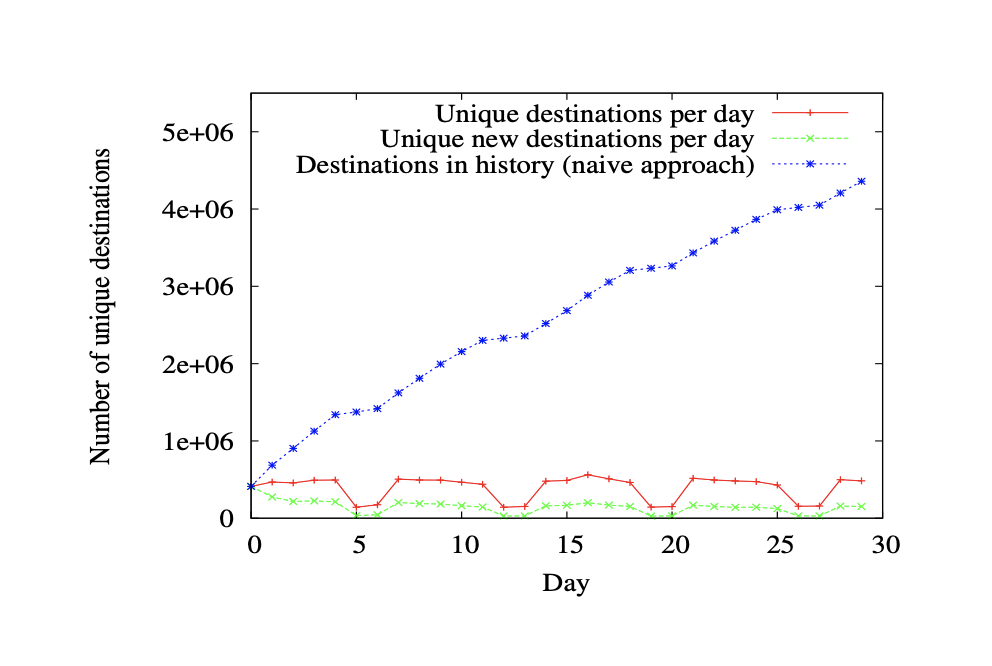
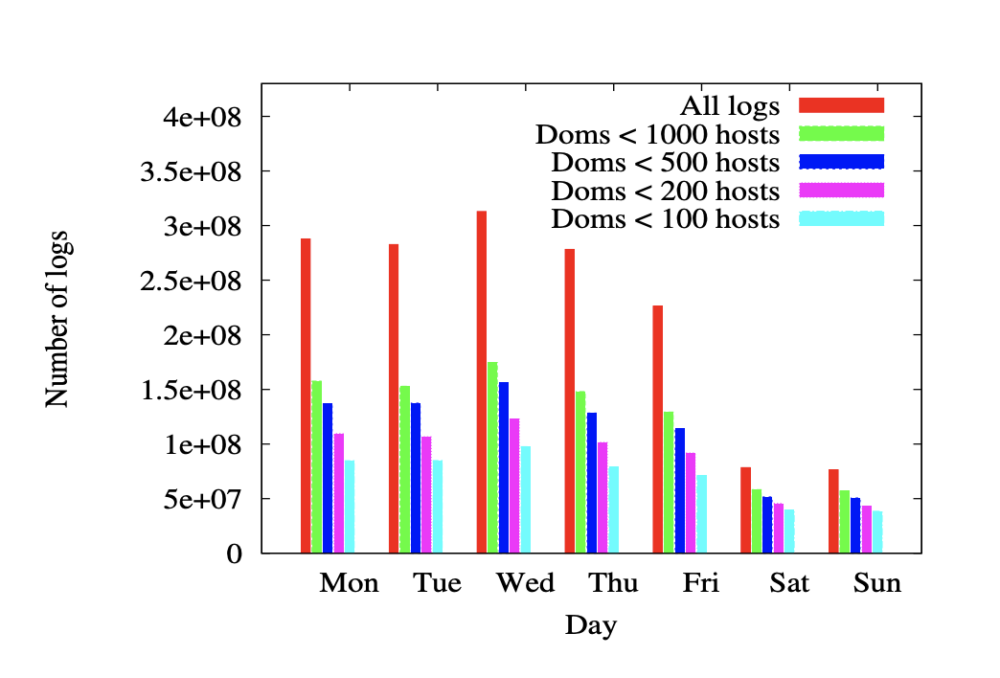
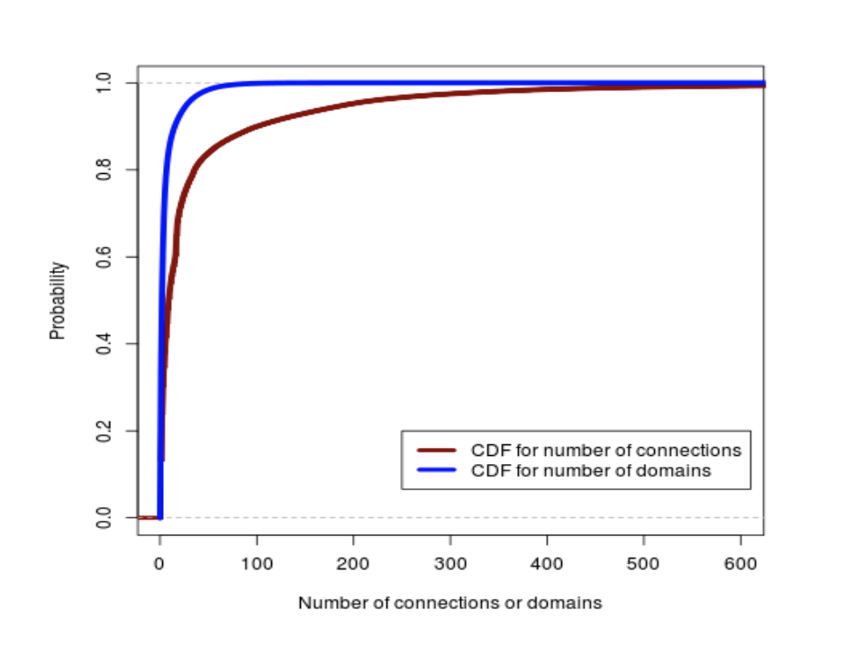
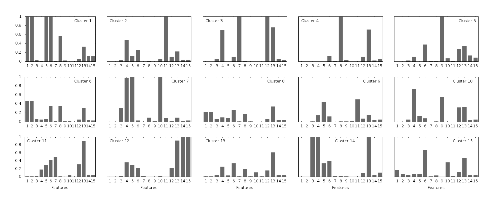
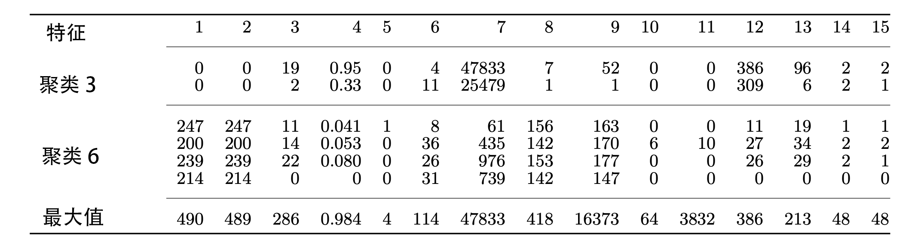
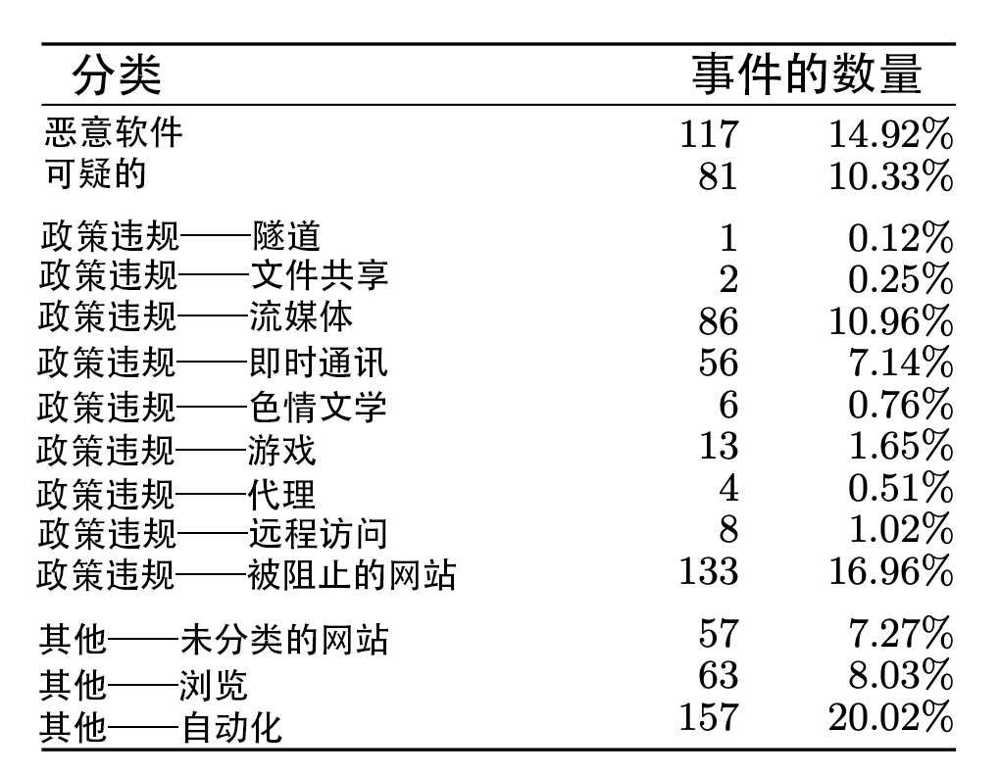
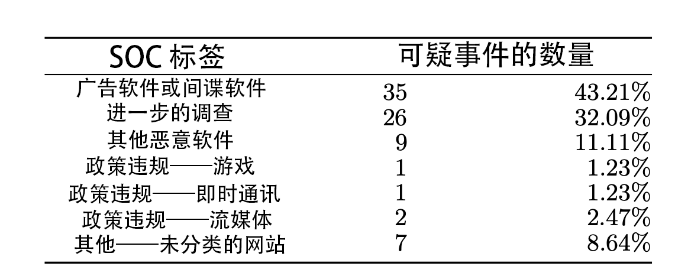

# 蜂窝：用于检测企业网络中可疑活动的大规模日志分析

## 摘要

随着越来越多基于互联网攻击的出现，组织正在通过部署各种安全产品来响应，这些产品以日志的形式生成情景智能。这些日志通常包含大量有关网络活动的有趣和有用的信息，并且是信息安全专家在怀疑攻击已经发生时首先咨询的数据源之一。然而，安全产品通常来自不同的供应商，并且这些产品的安装和管理不一致。它们生成的日志格式差异很大，而且往往是不完整的，相互矛盾的，并且数量非常大。因此，尽管这些收集到的信息很有用，但是通常被视为脏数据。

我们提出了一个新的系统，Beehive，它可以解决大型企业中各种各样的安全性产品产生的脏日志数据的自动挖掘和提取知识的问题。我们改进基于签名的方法来检测安全事件，而不是识别可疑主机的行为，Beehive将其报告为潜在的安全事件。然后，事件响应小组进一步分析这些事件，以确定是否发生了政策违规或攻击。我们对Beehive在一个大型企业EMC中收集的日志数据进行了为期两周的评估。我们将Beehive识别的事件与企业安全运营中心报告，防病毒软件警报和来自企业安全专家的反馈意见进行比较。我们发现Beehive能够识别恶意事件和政策违规的行为，否则这些行为将不会被检测到。

## 1. 引言 

保护大型组织中基础计算设施是一个越来越大的挑战。通用恶意软件和目标攻击（即高级持续威胁（APTs））渐渐变得越来越复杂，其能力超过传统防御措施例如防病毒软件。与此同时，随着员工越来越多地将个人设备用于商业应用，管理员对主机的姿态和主机的行为的可见性正在下降。此外，由于商业情报共享，承包商的关系和地域分布的新复杂性，传统的组织边界正在崩溃。

许多组织通过部署各种各样的安全产品来应对这一挑战，这些产品以安全日志的形式生成情景智能。这些产品代理web流量，检测恶意软件感染，检查策略违反，实现有效的身份验证机制以及执行许多其他有用的安全功能。

这些产品生成的日志包含大量有关网络活动的有趣和有用信息，并且是信息安全专家在怀疑攻击已经发生时首先咨询的数据源之一。例如，身份验证日志可能暗示了某个员工的账户已被攻破，因为登录来自目标员工从未去过的地区。另一个例子是，web代理日志可能会在他被偷渡式下载攻击危害之前记录受害者访问的站点。

虽然检查日志以发现或对网络中的可疑活动进行法医分析是一种标准做法，但此类调查在很大程度上仍是手工分析，常常依赖于已知威胁的签名。一个主要的挑战是，安全产品通常来自不同的供应商，并且安装和管理不一致。它们生成格式差异很大的日志数据，而且这些日志往往是不完整的，相互矛盾的，容量很大的（例如，大型企业中与安全相关的日志每天以兆兆字节级别(tb)增长），并且充满了非特定的或伪造的事件记录。因此，虽然这些收集到的信息是有用的，而且有时是手边的唯一信息，但同时它也常常是肮脏的。

本文解决了大型企业中各种各样的安全性产品产生的脏日志数据的自动挖掘和提取知识的问题。我们的目标是改进基于签名的方法来检测安全事件，而不是实现对标志着潜在的安全事件的可疑主机活动的行为检测。然后，事件响应小组进一步分析这些事件，以确定是否发生了政策违规或攻击。我们方法的一个关键观点是，在企业环境中观察到的行为通常比在开放互联网上观察到的行为更受政策和典型员工行为的约束。因此，我们可以通过分析来有效地识别可疑活动。

我们的自动化方法Beehive有三层：（1）使用网络特定的配置信息来解析、过滤和规范化日志数据的功能；（2）特征生成器，对规范化的日志数据进行处理，每天为每个主机生成一组15个不同的特征；（3）检测器，对特征进行聚类以识别无关的，处于可疑期的系统将其报告为事件的主机活动。

我们对Beehive在一个大型企业EMC中收集的日志数据进行了为期两周的评估。我们将Beehive识别的事件与企业安全运营中心报告，防病毒软件警报和来自企业安全专家的反馈意见进行比较。我们展示了Beehive能够识别企业网络中的许多恶意事件，包括恶意软件感染和政策违规，否则现有的、最先进的安全工具和人员就会忽略的事件。

我们的工作贡献如下：

  - 我们提出了一个新的自动化的方法叫做Beehive，它分析大型组织中收集的大量不同的日志数据以检测恶意活动例如恶意软件感染以及政策违规。Beehive利用企业网络中独特的特征生成准确的、可操作的信息。
  - 我们已经在超过6tb的日志数据上对Beehive进行了评估，并且准确地识别出了被现有的最先进的安全工具和人员忽略的可疑活动。
  - 据我们所知，我们的研究是对大量不同的，真实世界的日志数据的“大数据”安全分析挑战的首次探索。

## 2. 问题和挑战

在这里我们描述了我们所处理的威胁模型，系统操作的日志数据的性质以及在设计和评估Beehive时出现的挑战。

### 2.1 威胁模型

Beehive旨在检测在两种不同场景中出现的威胁。第一个场景涉及被感染的网络主机或面临感染风险的网络主机。此类主机可能表现出恶意或危险的行为，例如联系一个攻击网站，与命令和控制服务器（C&C server: command and control server）通信，或者泄漏数据到一个以前看不见的外部目的地。这些行为可能是由于恶意软件的自动化活动（例如：僵尸网络中的僵尸机器），由攻击者直接控制主机（例如：通过一个远程访问木马），或者是善意的用户被诱骗从而做出一些危险行为（例如：钓鱼攻击）。

第二个场景涉及违反企业政策的基于主机的用户活动。这些互动的目的不一定是恶意的，但是对商业有潜在的损害，因此是不受欢迎的。事例包括点对点的文件共享，即时消息传递，多媒体流媒体，成人内容查看，在线游戏以及使用代理和在一次试图绕过企业防火墙和其他网络周边安全机制的隧道服务。

### 2.2 数据

Beehive使用广泛的日志生成各种网络设备，其中包括记录每一个出站连接的web代理，记录动态IP地址分配的DHCP服务器，记录远程连接的企业网络的VPN服务器，记录在企业领域的认证尝试的Windows域控制器，和记录在终端主机上恶意扫描软件的结果的杀毒软件。这些日志存储在商业安全信息和事件管理（SIEM）系统中。

除了web代理之外，所有的这些设备都透明地监视和记录企业主机的活动。对于每个外部目的地，web代理会查询由产品供销商维护的域声誉评分和站点类别列表，如果目的地声誉较低或者是一个禁止类别（例如：成人内容站点）则会自动阻塞连接。然而，如果目的地不在这个列表中，代理会向用户展示一个警告页面，描述连接到未知目的地的潜在危险。用户必须明确地单击一个链接，以确认同意该公司的网络政策，否则不访问该网站。

Beehive使用了大量的web代理日志，因为企业中主要的网络活动是HTTP和HTTPS。此外，这些日志包含HTTP头部的所有字段，使它们成为理解用户浏览行为，检测可疑连接和预测分析的特别有用的资源。表1列举了web代理日志中的包含的字段的一个子集。

<table>
   <tr>
      <td>IP头</td>
      <td>源/目的IP和端口, 协议</td>
   </tr>
   <tr>
      <td>传输头</td>
      <td>目的域, URL, HTTP 状态码, web参照, 域声誉, 域目录, 用户代理串</td>
   </tr>
   <tr>
      <td>连接属性</td>
      <td>发送和接收字节, 网络政策</td>
   </tr>
</table> 

$$
表1: web代理日志中的字段
$$

在EMC，每天平均产生14亿条日志消息，每天大约产生1tb。这些“原始”日志包含大量的关于用户和主机行为的信息。他们也是杂乱的——有着非标准化的时间戳，不同的标识（例如，其中一些存储着主机的IP地址，一些存储着主机名，另外的存储着用户名），而且可能被截断或出现故障。我们将在下一节讨论分析这些“大数据”的挑战。

### 2.3 挑战

在现实生活中的企业网络观察到的和在SIEM系统中记录的大量事件在日志分析和安全事件检测中提出了一个重大挑战（“大数据”问题）。如上所述，在我们的案例研究中，我们观察到SIEM平均每天收集14亿个日志。Beehive对关键威胁的实时检测需要有效的数据缩减算法和策略来关注日志中与安全相关的信息。

Beehive的第二个挑战是在SIEM系统收集的日志和安全分析专家识别的可疑主机行为所需的信息之间存在明显的语义差别的情况下，识别有意义的安全事件。在我们的例子中，Beehive需要生成可疑主机的日常报告；然而，大多数网络设备仅仅记录网络终端的IP地址。将Ip 地址和特定主机关联需要跨不同日志进行关联，这对网络中动态分配IP地址时尤其具有挑战性。日志记录设备可能位于不同的时区（这是全球组织的典型基础结构），因此必须对其生成的时间戳进行规范化以实现精确的时间相关性，因此情况更加复杂。

最后，设计Beehive一个主要的挑战是，由于固有的缺乏标记好的真实数据，很难精确评估其有效性。具体来说，企业网络通常在网络周边和主机上部署最先进的安全技术，并且安全分析专家积极致力于解决已知的事件。因此，从这样一个网络中获得的真实网络数据往往缺乏已知安全威胁的痕迹。例如，主机上的恶意软件通常在激活前就被清理或被隔离，访问僵尸网络C&C服务器通常被防火墙阻断。这种威胁解决方案阻止了针对已知恶意网络流量的标记好的真实数据的Beehive的自动化测试，因为没有证据。Beehive识别的许多事件实际上对于企业中使用的安全系统来说是未知的。因此，我们必须依赖人工评估的安全事件和Beehive识别的可疑主机。

在设计Beehive时，我们探索和处理大数据安全分析带来的挑战。简单来说，在预处理阶段，Beehive将所有日志条目的时间戳规范化为UTC，决定静态或动态地为主机分配IP地址，构造主机和IP地址之间的绑定，从而将每个记录的事件归属到特定的主机。然后，Beehive为个人的主机提取企业特有的特性，并且将具有相似可疑行为的主机进行聚类。由此产生的外部聚类作为事件供安全分析专家检查。

为了评估Beehive在本研究中的有效性，我们借助安全运营中心（SOC）对其报告的事件进行了人工调查。考虑到现有企业对已知签名攻击的解决方案，我们研究中特别感兴趣的是Beehive对用户网络政策违规和当前基于签名的工具未检测到的恶意软件的识别。

## 3. 蜂窝系统

在本节中，我们将详细描述Beehive系统的操作。我们首先描述了消除SIEM收集到的数据中的噪声和矛盾。然后我们将讨论在企业环境中检测不当行为的特征的选择。最后，我们描述了我们用来产生异常宿主行为事件的无监督学习方法。

### 3.1 数据标准化

为了解决在前面部分中解释的脏数据和不一致数据的挑战，Beehive在开始其行为分析前对日志数据进行了预处理。我们将在下面解释这个过程的不同阶段。

**时间戳标准化**。在运行全局网络的企业中，生成关键日志的设备位于不同的地理位置。此外，这些设备以不同的方式记录时间戳，可能使用它们的本地时区，UTC或用其它时间表示。这导致日志条目有着不一致的时间戳，这些事件戳在任何分析变得准确之前，必须将其规范化为标准表示形式。虽然对于小型网络来说，将协调时间设置委托给网络管理员是可行的，但是这些方法在全球规模的企业网络上是不可行的。

Beehive利用企业的中央SIEM日志管理系统来解决这个问题，该系统使用自己的时间戳$t_{siem}$ 标记每个日志条目，记录SIEM接收这条日志的时间。对于每个发送日志到SIEM系统的设备，我们首先计算一组时差值$\Delta_i = t_{siem,i} - t_{device,i}$(四舍五入到最近的30分钟)，这些值来自于在一个大的时间段内（例如一个月）生成的每个日志条目$i$ 。接着，我们确定设备的时间戳修正值$\Delta_{correction}$是通过过将其设置为占大多数差异的值$\Delta_{i}$ 。 将这个修正值应用到每个设备的时间戳给了我们一个标准化的时间戳值，$t_{normalized,i} = t_{device,i} + \Delta_{correction}$。在我们的例子中，由于EMC的SIEM系统被配置为使用UTC时间戳机制，$t_{normalized,i}$ 对应UTC时间。我们将这种规范化技术应用到网络上产生日志的每个设备，将所有的日志时间戳规范化为UTC。

**IP地址到主机的映射**。在企业环境中，终端主机通过动态主机配置协议（DHCP）连接到网络时，通常在短时间内被动态分配IP地址。这使得在分析期间很难将日志中报告的IP地址和唯一主机关联起来，因为在事件被记录之后，不同的主机可能会分配到相同的IP地址。

为了解决这个问题，Beehive分析了在SIEM系统中收集到的DHCP服务器日志，并构建了一段时间内IP到主机映射（即绑定）的数据库。每一个绑定都表示为在特定的时间间隔将IP地址映射到主机的元组{IP地址，主机名，MAC地址，开始时间，结束时间}。每天运行此算法以在新DHCP日志可用时更新现有绑定。给定生成的绑定数据库，Beehive可以参考标准化的时间戳来识别与给定IP地址相对应的主机。

**静态IP地址检测。** 我们构造的绑定数据库上的IP到主机的查询可能会失败，因为IP地址是静态分配给特定主机的，而不是动态租用的。然而，在大型企业网络中维护静态IP地址分配列表很困难，并且管理员创建的列表通常不存在或已过时。因此，Beehive还采用以下方法自动识别具有静态IP地址的主机。

在引导步骤中，我们首先检索在所有收集到的日志中找到的所有IP地址，以创建在企业中活动的IP地址池。由集合A表示。接下来，我们从日志中检索IP地址，我们知道这些IP地址必须只包含具有动态IP地址的主机，例如DHCP和VPN日志，以创建已知动态IP地址池，由集合D表示。然后我们计算包含潜在静态IP地址的集合差异$S = A - D$ ，为每个在S中的地址执行反向DNS查询，并保存结果以完成引导阶段。当新的日志变得可用时，我们周期性的（例如，每天一次） 重复该过程以获取新的IP地址并相应地更新集合A，D和S。然而，和之前不同的是，每次迭代时，我们将S中的IP地址解析为其主机名，并将名字与先前存储的值进行比较。如果主机名在两次迭代之间发生了变化，我们就得出结论，给定的IP地址不是静态分配的，我们从集合S中删除它。通过这种方法，我们在每次迭代时都会优化潜在静态IP地址池。如果Beehive未能找到IP到主机查找的相应绑定，但是在S中找到了给定地址，我们将该IP地址视为一个静态主机并使用S中找到的主机名。

**专用主机。** Beehive专注于监视由专用主机的行为，这些主机是由单个用户使用的机器。由于不断变化的网络配置，大型企业难以维护专用主机列表，因此我们根据SIEM系统中可用的数据推断出专用主机列表。

为此，我们使用微软Windows域控制器生成的身份验证日志。对于企业中的每个用户，保留用户已经认证（即，登录）的主机的历史，认证的数量和认证时间戳。这些信息将在三个月内收集，以建立准确的用户活动历史记录。在收集期结束时，如果单个用户负责该主机上的大多数（例如，95％）认证事件，则我们将主机视为“专用”。通过此流程，我们确定了EMC的78,000多个专用主机。

### 3.2 特征提取

我们从日志中提取特征以表征来自企业的出站通信。我们的特征选择是通过观察EMC中已知的恶意软件行为和政策违规以及Beehive运行环境的属性为指导，即以严格防火墙策略的形式存在的外围防御，（大多数）用户活动的业务方向，以及企业托管主机的（相对）同类软件配置。

对于企业中的每个专用主机，我们每天生成一个特征向量，其中包括表2中列出的15个特征。这些特征可以被分成4类，基于主机联系的新的和不受欢迎的目的地特征，与主机相关的功能软件的配置，与公司政策相关的特征，以及基于流量和时间的特征。我们将在下面详细描述它们中的每一个。

<table>
   <tr>
      <td align="center">特征类型</td>
      <td align="center">#</td>
      <td align="center">描述</td>
   </tr>
   <tr>
      <td rowspan="4">基于目的地</td>
      <td>1</td>
      <td>新的目的地</td>
   </tr>
   <tr>
      <td>2</td>
      <td>没有白名单参考的新的目的地</td>
   </tr>
   <tr>
      <td>3</td>
      <td>不受欢迎的原始IP目的地</td>
   </tr>
   <tr>
      <td>4</td>
      <td>部分不受欢迎的原始IP目的地</td>
   </tr>
   <tr>
      <td>基于主机</td>
      <td>5</td>
      <td>新的用户代理字符串</td>
   </tr>
   <tr>
      <td rowspan="6">基于政策</td>
      <td>6</td>
      <td>阻塞域</td>
   </tr>
   <tr>
      <td>7</td>
      <td>阻塞连接</td>
   </tr>
   <tr>
      <td>8</td>
      <td>受质疑的域</td>
   </tr>
   <tr>
      <td>9</td>
      <td>受质疑的的连接</td>
   </tr>
   <tr>
      <td>10</td>
      <td>同意的域</td>
   </tr>
   <tr>
      <td>11</td>
      <td>同意的连接</td>
   </tr>
   <tr>
      <td rowspan="4">基于流量</td>
      <td>12</td>
      <td>连接峰值</td>
   </tr>
   <tr>
      <td>13</td>
      <td>域峰值</td>
   </tr>
   <tr>
      <td>14</td>
      <td>突发连接</td>
   </tr>
   <tr>
      <td>15</td>
      <td>突发域</td>
   </tr>
</table>

$$
表 2: Beehive的特征
$$

#### 3.2.1 基于目的地的特征

我们感兴趣的是识别那些从未（或很少）与EMC内部联系的新的或不知名的外部目的地进行通信的主机。假设受欢迎的网站管理得很好，而且不太可能受到损害，那么与不常见目的地的连接可能表明存在可疑行为(例如，与命令和控制服务器的通信)。

**新的目的地。** 我们的第一个基于目的地的特征是每个主机每天联系新的外部目的地的数量。随着时间的推移，我们建立内部主机联系的外部目的地的历史。在一个月的初始引导期之后，如果在观察期内企业中的主机从来没有联系过某个目的地（并且这个目的地不是历史记录的一部分），我们认为这个目的地在特定日期是新的。我们每天都会更新目的地以包含前一天联系的新的目的地。

在分析Web代理日志以构建外部目的地的历史记录时，我们遇到了许多挑战。在我们最初的幼稚的实施中，我们处理每个代理日志，解析所有IP地址目的地，并在历史记录中包含所有观察到的新目的地。事实证明，这种天真的方法在运行时间和历史规模方面都不具备可扩展性。

首先，这个天真的方法花费15个小时处理一天中有价值的web代理日志（相当于3亿条日志，或者600GB）。其次，令我们惊讶的是，新目的地的数量并没有随着时间的推移而减少，即使历史记录的规模在一个月内增长到430万个唯一目的地。如图1所示，每天有30%到40%（大约14500个）的唯一目的地是新的。在这种方法中，所有这些新目的地每天都被添加到历史中，因此历史记录的大小会随着时间的推移而无限增长。

对Web代理日志的进一步检查表明，大多数新目的地是内容交付网络（CDN），云服务（经常使用随机字符串作为子域），或属于受欢迎服务的IP地址（谷歌，Facebook，推特）。为了使Beehive可扩展，我们采用了许多数据缩减技术，其中包括过滤，自定义白名单和域名“折叠”。

$$
图 1: 内部主机联系的目的地，天真的方法。
$$

我们首先通过创建自定义白名单来过滤“流行的”目的地，其中“流行度”是在企业中的主机上定义的。白名单包括随时间（即，一周的训练周期）的交互内部主机的数量超过阈值的外部目的地（域名和IP子网）。图2显示了使用从2013年4月的第一周数据构建的报名单过滤的网络流量。100个主机的阈值实现了从每天3亿个日志减少到8000万个——Beehive需要处理的日志数量减少74%。

除了自定义白名单外，我们还将目的地“折叠”到二级域名，以便过滤使用随机字符串作为子域的服务。我们还忽略了检索收藏夹图标的连接——这可能是由于书签。最后，我们选择不解析原始IP地址（因为大多数合法站点都是通过它们的域名来引用的），并且我们将这些不在白名单上的原始IP地址看作“新目的地”。

这些优化将每天处理日志数据的时间从15小时减少到大约5小时。添加到历史记录中的新（折叠）的目的地的数量减少到平均每天28000个。经过四个月（从2013年1月13日到5月13日），我们的外部目的地历史记录有270万个折叠域，而通过天真的方法构建的历史记录一个月后就有430万个域。

**没有白名单参照的新的目的地。** 我们的第二个基于目的地的特征是第一个的扩展，但是主机联系的新目的地的数量是在没有白名单HTTP引用页的情况下计算的。用户通常是通过搜索引擎、新闻站点或广告定向到新站点的。在这些情况下，我们希望HTTP引用页在我们的自定义白名单中列出。那些访问新站点而没有被有信誉的引用页(或者根本没有引用页)的主机会被认为更可疑。

**不受欢迎的IP的目的地。** 我们还对不受欢迎的外部目的地（原始IP地址）感兴趣。我们首先计算主机连接的目的地的数量，这些目的地既不受欢迎（不在上面描述的自定义的白名单上），也属于IP地址。连接到不受欢迎的IP地址可以指示可疑活动，因为合法的服务通常可以通过他们的域名访问。其次，我们将主机当天联系的不受欢迎的目的地的IP地址部分也包括在内。虽然偶尔与IP目的地的通信是正常的（例如，与CDNs拥有的IP范围通信），但这种行为在频繁时是可疑的。

$$
图 2: 通过自定义的白名单减少数据
$$

#### 3.2.2 基于主机的特征

与学术网络中的主机相比，企业中的主机在软件配置上更加一致。因此，我们感兴趣的是主机安装的新的（可能是未授权的）软件。

由于主机缺乏可见性，并且只能访问网络设备收集的日志， 我们从包含HTTP请求头的用户代理（UA）字符串中推断主机上的网络配置。一个用户代理字符串包含发送请求的应用的名字，版本，功能和操作环境。因此，基于主机的特征就是来自主机的“新的”用户代理字符串的数量。

我们在一个月的时间内为每个主机构建一个用户代理字符串的历史记录，在此期间存储从主机观察到的每一个用户代理字符串。之后，如果一个用户代理字符串与该主机历史记录上的所有用户代理字符串有足够的区别，那么它被视为“新的”（用户代理字符串）。编辑距离（也称为莱文斯坦（Levenshtein）距离）用于比较用户代理字符串，测量将一个字符串转换为另一个字符串所需的字符插入，删除和替换的数量。这使我们能够适应软件更新产生的其中只有一个子字符串(例如版本号)发生了更改的“新”UA字符串。

#### 3.2.3 基于策略的特征

企业环境的另一个独特之处在于对出站连接执行网络政策。如2.2节所述，外部目的地的连接可以被阻止如果这个目的地的信誉可疑或被列为禁止员工连接。因此，阻塞域（和连接）是主机错误行为的粗略指示器。

前往一个未知的目的地（即，尚未分类或评级的），用户必须明确同意遵守公司的政策才能继续使用。我们将需要此确认的域（和连接）称为受质疑的，将用户已经同意的称为已同意的。

我们基于策略的特征包括上述三种通信类型。对于主机，我们计算被阻塞、被质疑或被同意的主机所联系的域（和连接）的数量。

#### 3.2.4 基于流量的特征

主机流量的突然激增可能是由于恶意软件（例如，扫描或响应僵尸主控机（botmaster）命令的机器活动）或自动化进程引起的。我们基于流量的特征试图通过主机产生异常高流量的时间段来捕获这些有趣的活动。

具体来说，当主机产生的连接（或接触的域）的数量高于阈值时，我们将一个连接（或域）的峰值定义为一个一分钟的窗口。连接（或域）的突发是每分钟都是连接(或域)峰值的时间间隔。

为了确定“高”流量的合适阈值，我们检查了一周内所有专用主机，并且计算了每个主机每分钟生成（或接触）的连接（和域）的数量。图3展示了所有专用主机在所有一分钟窗口中的累积分布。90%的主机每分钟生成少于101个连接，接触少于17个不同的域。因此，我们把连接阈值和域阈值设置为这些值（连接阈值101，域阈值17）。

$$
图 3: 每分钟的网络连接数和主机联系的域名数的累积分布函数（CDF）
$$

对于突发，我们放宽了它的定义，因此突发中峰值的阈值是所有主机上所有一分钟窗口的75%。连接峰值的阈值是26，域峰值的阈值时6。

对于每一个专用主机，它的基于流量的特征包括：1）连接峰值的数量，2）域峰值的数量，3）最长连接突发持续时间，4）最长域突发持续时间。

### 3.3 聚类

由于缺乏主机被感染或行为异常的基本事实（我们在2.3节描述了这一挑战），我们通过一种非监督的学习方法——聚类来解决这一问题。由于企业员工在企业网络上执行着特定的工作职能，并且在大多数部门都有多个员工，所以我们应该能够观察到一组主机（属于有相似角色的用户）表现出相似的行为，而行为模式独特的是异常主机。

考虑到3.2节中描述的15个特征，每个内部主机表示为一个15维向量，$$v = (v[1],v[2],...,v[15])$$。但是，这些特征可能是相互关联或是相互依存的；例如，域峰值也会触发连接峰值。为了消除特征之间的依赖关系，降低向量的维数，我们采用主成分分析（PCA）方法。

简单地说，主成分分析通过将原始向量投射到一组新的轴（即，主成分）实现数据的缩减。每个主成分的选取是为了尽可能多地捕获到数据中的差异（从而获得原始信息）。根据我们想要从原始数据中获取的方差大小，我们选择最上面的m个主成分，这样就可以将原始向量降维到m。在Beehive中，我们选择前m个分量至少获取数据95%的方差。

将聚类算法应用于主成分分析后的投影向量。我们的算法是对K-均值（K-means）聚类算法的改进，但是这种算法不需要预先指定聚类的数量。

1. 随机选择一个向量作为第一个聚类中心。将所有的向量赋给这个聚类。
2. 选择离这个聚类中心最远的向量作为新的聚类中心。将每个向量重新分配给距离自己最近的聚类中心。
3. 重复第二步，直到没有任何向量的到聚类中心的距离超过中心到中心距离的一半。

我们通过距离L1来比较两个向量，即，对于向量$$v1$$和$$v2$$ ，他们之间的距离$$L1Dist(v1,v2) = \sum_{i=1}^m |v1[i] - v2[i]|$$。 

Beehive中的聚类算法每天应用于企业中所有活动、专用主机的特征向量。（我们观察到工作日活跃的主机数量在27000到35000台之间，周末活跃的主机数量在9000到10100台之间。）有趣的是，算法经过一次迭代后，绝大多数主机都属于一个大的集群，而剩下的聚类只包含极少数行为与标准偏离的主机（即，异常值）。 

Beehive为最外围的主机生成了事件，并且将它们报告给安全分析人员。请注意，该算法通过迭代标识离聚类中心最远的节点来形成集群，因此集群对它们有一个固有的顺序。以防算法受到极端异常值的干扰（例如，只形成两个集群，一个只有一个节点，另一个具有所有其他节点），我们将PCA和聚类算法再次应用于最大的集群。此过程将迭代，直到每天至少识别出50个外围主机。

## 4. 评价

2013年4月22日至5月5日，我们在一家大型企业EMC中对Beehive进行了为期两周的评估。在此期间，Beehive共生成784起事件，平均每天生成56起事件，标准差为6.88。在这些事件中，只有8个事件与企业最先进的安全工具生成的警报重叠。

为了在缺乏基础事实的情况下对Beehive进行评估——在准确的意义上，现有的对已识别事件的分类，我们采用了手工调查的两步过程。我们首先检查并标记由Beehive产生的所有事件(参见4.2节)。无法识别原因的事件被标记为“可疑事件”，并提交给企业安全运营中心(SOC)进行进一步分析(见4.3节)。

### 4.1 聚类上下文

除了主机和它的特征向量外，每一个Beehive事件还包括每台主机所属集群的上下文信息，例如集群中主机的数量和特征向量的平均值。这些信息有助于下面描述的手动调查的过程，因为它允许分析人员可以很快地识别每个集群的不同特性。

为了给出直观的集群捕获的活动类型，图4显示了4月24日生成的全部15个外围集群的标准化平均特征向量。也就是说，我们首先根据一个集群中所有向量的平均值计算出每个集群的均值特征向量，接着在对每个向量分量进行标准化，即，特征值是相对于所有均值特征向量的最大值。如图4显示，集群的不同之处在于它们具有不同的（子集）特征。

$$
图 4:2013年4月24日生成的聚类的归一化平均特征向量。
$$
虽然每个集群都不一样，但是在同一集群中的主机表现出非常相似的行为。表3显示了4月24日两个示例集群（3和6）中的主机实际的特征向量。例如，集群3的独特之处在于它的阻塞连接，连接峰值，域峰值的数量非常之多——这意味着是一个自动化的过程负责该活动。（事实上，在下一节描述的调查过程中，我们发现在该集群中的主机通过过度联系被阻塞的域而违反了公司政策。）在另一个示例中，集群6中的主机连接了大量新的目的地，并产生了和阻塞域和受质疑的域的连接峰值。我们的调查显示，该集群仅由与动态生成域(DGAs)连接的受感染主机组成。在下面，我们详细介绍了我们的手工调查过程和Beehive检测到的可疑活动。

$$
表 3: 两个示例集群中主机的特征向量。每行对应于该集群中主机的特征向量。
$$

$$
最后一行显示了2013年4月24日所有集群中每个特征的最大值。
$$

### 4.2 手动标记

我们对主机的手动调查过程从识别主机集群特有的特征开始。然后，我们试图通过Beehive报告的上下文信息和检查SIEM系统收集的关于主机的原始日志信息来识别这种区别的根本原因。后者涉及查找来自主机连接中的用户代理字符串，HTTP状态码，web引用页和计时模式，以及所联系域的声誉（使用McAfee SiteAdvisor和URLvoid）和它们注册时的声誉（使用Domain Tools）。

简而言之，25.25%的Beehive事件是被证实的恶意软件或“可疑”事件(我们在4.3节中提供了更多关于“可疑”事件的详细信息)，39.41%的事件违反了企业安全政策，35.33%的事件与未识别(但有噪声的)软件或服务有关。表4列出每一类事件的数目和百分比。

$$
表 4:2013年4月22日至5月5日两周内蜂箱事件类别细分
$$
Beehive检测到的许多恶意软件都联系（或尝试联系）通过域名生成算法（DGAs）创建的域。基于目的地的特征（见3.2节）在识别此类恶意软件被证明是最有用的，因为大多数DGA主机都位于具有大量新目的地的集群中。在图4所示的4月24日的集群中，集群1、6和8中的所有主机都被证实感染了DGA恶意软件。这些感染以前都没有被杀毒软件或企业SOC检测到。

Beehive还检测到对企业网络安全政策的违反。与许多公司一样，这些规定禁止个人大量使用公司计算资源、安装未经公司明确同意的软件、访问具有攻击性的材料(例如色情或其他贬损性的内容)，以及出于商业目的而不当地大量消耗带宽。我们的手动调查发现，16.96%的与外部目的地繁忙通信相关的事件由于业务问题或被标记为潜在的不安全（例如，与免费软件有关的站点）而被阻塞。10.96%的事件是由高容量视频流应用程序引起的，通常以连接或域峰值或大量受质疑的连接为特征。其他事件包括文件共享、第三方即时消息传递、在线游戏、成人内容浏览、或使用隧道或代理服务绕过网络安全机制(例如，访问被屏蔽的网站)。除了恶意软件和政策违规之外，Beehive还检测到来自可能是良性的、但未被识别的、并且可能是自动化的应用程序的不寻常的活动。例如，20.02%的事件涉及每天连接同一网站上万个连接的主机。这些站点通常是新闻、体育或金融站点，但包括广告服务器、在线论坛和位于谷歌应用程序引擎上的站点。几个主机被发现在挖掘比特币。我们把所有这些主机都标为“其他自动化的”。

最后，8.03%的事件要么有大量(每天数千次)的同意连接，表明用户在继续访问站点之前已经明确承认了公司的网络策略，要么有较长时间(即，持续数小时)的持续网络流量到各个域。由于没有恶意行为的进一步证据，我们将这些事件归为“其他浏览”类别，尽管它们可能并非完全由用户驱动。

### 4.3 SOC的调查

在4.2节中描述的第一轮人工标记过程产生了81起事件（10.33%），我们无法识别对事件中观察到的行为负责的应用程序。这些事件中的主机与低信誉的网站（例如，由防病毒供应商标记，在过去六个月时间内注册，使用类似域名生成算法（DGA）的子域名）通信、下载可执行文件或压缩文件、使用格式不正确的HTTP用户代理字符串，或者以半规则的间隔重复联系相同的URL。

我们将这些事件标记为“可疑事件”，并将它们提交给企业安全运营中心(SOC)进行第二轮的分析。表5显示了SOC给这些事件分配的标签。

$$
表 5: 由SOC在EMC分类的可疑事件
$$

虽然54.32%的“可疑”事件被SOC确认为广告软件、间谍软件或已知的恶意软件，但有相当一部分（32.09%）被认为是严重事件值得进一步调查。这些有问题的活动可能是以前未知的恶意软件或其他对最先进的安全工具不透明威胁，需要深入的主机检查来确定确切的根本原因。

少数经过调查的“可疑”事件被认为是政策违规（4.93%）或未分类网站（8.64%）。他们与不知名软件或低信誉网站的联系，促使他们在第一轮调查中被认定为“可疑”事件。

### 4.4 总结

在企业安全运营中心（SOC）的帮助下，我们手工调查了在两个星期的过程内产生的784个Beehive事件。总的来说，我们发现其中25.25%的事件与恶意软件相关，或者需要SOC进一步的调查，39.41%的事件属于政策违规，35.33%的事件与未识别但自动化的软件或服务有关。只有8个事件（占总事件1.02%）是由现有的最先进的安全工具检测到的，这表明了Beehive预先识别未知的异常的行为的能力。

## 5. 相关工作

使用统计和机器学习技术的基于网络和主机的入侵检测系统已经经历了20年的广泛研究[11,15,33]。此外，结合签名、流量和异常检查技术的商业和开源产品在今天都是广泛可用的[1,2,3]。但是，据我们所知，我们首次研究了对从这种规模的企业收集的大规模日志数据进行消毒，关联和分析以及检测受损主机和业务策略违规的挑战。

例如，Chapple等人[12]提出了一个利用基于地理距离的聚类技术检测大学虚拟专用网异常认证尝试的案例研究。Zhang等人[41]对这种方法进行了扩展，增加了机器学习特性，以自动检测大学网络中VPN账户的危害。在早期的研究中，Levine等人[26]使用蜜罐来检测企业网络上被利用的系统。类似地，Beehive旨在为安全分析人员自动执行检测任务。然而，除了新的检测方法之外，我们还提出了迄今为止在真实生产网络中规模最大的案例研究，以及分析大而不相交的日志数据的独特挑战。

虽然已有的工作分析了网络上特定类型的恶意活动（例如蠕虫[37]或恶意灌水者[32]），但是最近的恶意软件检测的尝试主要集中在对僵尸网络的检测。例如，一些系统[10,27,35]使用分类和相关技术来识别来自IRC僵尸网络的C&C通信。BotTrack[16]将一种基于网络的方法与分页算法相结合来检测P2P僵尸网络。许多研究监测多台主机的群体通信行为，并分析它们之间的时空相关性，以检测僵尸网络感染的主机，而不依赖于用于C＆C通信的协议[18,20,24,40]，而其它的特别关注DNS流量相似性[13,36]。BotHunter[19]检查网络周边的双向通信，以识别僵尸网络感染的特定阶段。披露[8]提出了一套检测功能，以识别使用NetFlow记录的C&C流量。而其他一些研究则专门关注DNS流量相似性[13,36]。BotHunter[19]检查网络周边的双向通信，以识别僵尸网络感染的特定阶段。DISCLOSURE [8]提出了一套检测特征，以识别使用数据交换方式记录的C&C流量。其他研究集中于跟踪和测量僵尸网络[4,14,17,22,34]。

其他工作旨在识别表现出恶意行为的域而不是受感染的主机。例如，一些系统[30,29,31,21]提出了用于恶意快速通量服务的各种检测机制。在更通用的方法中，EXPOSURE [9]，Notos [5]和Kopis [6]执行被动DNS分析以识别恶意域。马等人 [28]从垃圾邮件中提取词汇和基于主机的URL功能，并使用域名上的主动DNS探测来识别恶意网站。另一个研究分支旨在通过对其词汇结构进行建模并利用使用此类域的僵尸网络中观察到的大量失败DNS查询来检测动态生成的恶意域[7,38,39]。相反地，Beehive使用标准日志数据来检测企业网络中的可疑活动。

这些方法使用网络数据进行检测。相反地，Beehive使用脏的企业日志数据来检测潜在的恶意主机行为以及特定于企业设置的政策违规。

## 6. 结论

在本文中，我们提出了一个名为Beehive的新系统，它可以解决大型企业中从各种网络设备产生的脏日志数据的自动挖掘和提取知识的问题。主要挑战是“大数据”问题（在EMC，平均每天产生14亿条日志消息 - 大约1TB），以及存储在日志中的信息与安全分析师为检测可疑行为要求的信息之间的语义差距。

我们开发了有效的技术来消除日志中的噪声，包括将日志时间戳规范化为UTC并创建IP到主机名映射，以跨日志类型标准化主机标识符。使用通过观察企业中的通信模式构建的自定义白名单，我们有效地将Beehive每天检测到的3亿条日志消息的数据减少到8000万条（减少74％）。

Beehive改进了基于签名的方法来检测安全事件。相反，它根据行为分析标记主机中可疑的安全事件。在我们的评估中，Beehive检测到恶意软件感染和违反政策的行为，而这些现有的，最先进的安全工具和人员却没有注意到。具体而言，对于在两周内在大型企业中收集的日志文件，25.25％的Beehive事件被确认为与恶意软件相关或需要企业SOC进一步调查，39.41％是违反政策的行为，35.33％与未识别的软件相关联或服务。

据我们所知，我们的研究是对“大数据”安全分析在现实世界企业日志数据规模上的挑战的首次探索。

## 致谢

我们非常感谢EMC CIRT团队的成员为我们提供了对企业日志数据的访问权限，以及在调查Beehive警报方面他们的帮助。

该研究部分由美国国家科学基金会资助（NSF）授予CNS-1116777。 Engin Kirda也感谢Sy和Laurie Sternberg的慷慨支持。

## 7. 参考文献
[1] OSSEC – Open Source Security. http://www.ossec.net.

[2] Snort. http://www.snort.org.

[3] The Bro Network Security Monitor.
http://www.bro.org/.

[4] M. Abu Rajab, J. Zarfoss, F. Monrose, and A. Terzis.
A Multifaceted Approach to Understanding the Botnet Phenomenon. In IMC, 2006.

[5] M. Antonakakis, R. Perdisci, D. Dagon, W. Lee, and N. Feamster. Building a Dynamic Reputation System for DNS. In USENIX Security, 2010.

[6] M. Antonakakis, R. Perdisci, W. Lee, N. Vasiloglou, II, and D. Dagon. Detecting Malware Domains at the Upper DNS Hierarchy. In USENIX Security, 2011.

[7] M. Antonakakis, R. Perdisci, Y. Nadji, N. Vasiloglou, S. Abu-Nimeh, W. Lee, and D. Dagon. From Throw-away Traffic to Bots: Detecting the Rise of DGA-based Malware. In USENIX Security, 2012.

[8] L. Bilge, D. Balzarotti, W. Robertson, E. Kirda, and C. Kruegel. Disclosure: Detecting Botnet Command and Control Servers Through Large-scale NetFlow Analysis. In ACSAC, 2012.

[9] L. Bilge, E. Kirda, K. Christopher, and M. Balduzzi. EXPOSURE: Finding Malicious Domains Using Passive DNS Analysis. In NDSS, 2011.

[10] J. R. Binkley and S. Singh. An Algorithm for Anomaly-based Botnet Detection. In USENIX SRUTI, 2006.

[11] D. Brauckhoff, X. Dimitropoulos, A. Wagner, and K. Salamatian. Anomaly Extraction in Backbone Networks Using Association Rules. In IMC, 2009.

[12] M. J. Chapple, N. Chawla, and A. Striegel. Authentication Anomaly Detection: A Case Study on a Virtual Private Network. In ACM MineNet, 2007.

[13] H. Choi, H. Lee, H. Lee, and H. Kim. Botnet Detection by Monitoring Group Activities in DNS Traffic. In IEEE CIT, 2007.

[14] E. Cooke, F. Jahanian, and D. McPherson. The Zombie Roundup: Understanding, Detecting, and Disrupting Botnets. In USENIX SRUTI, 2005.

[15] G. Dewaele, K. Fukuda, P. Borgnat, P. Abry, and K. Cho. Extracting Hidden Anomalies Using Sketch and non Gaussian Multiresolution Statistical Detection Procedures. In ACM SIGCOMM LSAD, 2007.

[16] J. Franc ̧ois, S. Wang, R. State, and T. Engel. BotTrack: Tracking Botnets Using NetFlow and PageRank. In IFIP TC 6 Networking Conf., 2011.

[17] F. C. Freiling, T. Holz, and G. Wicherski. Botnet Tracking: Exploring a Root-cause Methodology to Prevent Distributed Denial-of-service Attacks. In ESORICS, 2005.

[18] G. Gu, R. Perdisci, J. Zhang, and W. Lee. BotMiner: Clustering Analysis of Network Traffic for Protocol- and Structure-independent Botnet Detection. In USENIX Security, 2008.

[19] G. Gu, P. Porras, V. Yegneswaran, M. Fong, and W. Lee. BotHunter: Detecting Malware Infection Through IDS-driven Dialog Correlation. In USENIX Security, 2007.

[20] G. Gu, J. Zhang, and W. Lee. BotSniffer: Detecting Botnet Command and Control Channels in Network Traffic. In NDSS, 2008.

[21] T. Holz, C. Gorecki, K. Rieck, and F. C. Freiling. Measuring and Detecting Fast-Flux Service Networks. In NDSS, 2008.

[22] J. P. John, A. Moshchuk, S. D. Gribble, and
A. Krishnamurthy. Studying Spamming Botnets Using Botlab. In USENIX NSDI, 2009.

[23] I. T. Jolliffe. Principal Component Analysis. Springer-Verlag, 1986.

[24] A. Karasaridis, B. Rexroad, and D. Hoeflin. Wide-scale Botnet Detection and Characterization. In USENIX HotBots, 2007.

[25] L. Kaufman and P. J. Rousseeuw. Finding Groups in Data. An Introduction to Cluster Analysis. Wiley, 1990.

[26] J. Levine, R. LaBella, H. Owen, D. Contis, and B. Culver. The Use of Honeynets to Detect Exploited Systems Across Large Enterprise Networks. In IEEE IAW, 2003.

[27] C. Livadas, R. Walsh, D. Lapsley, and W. Strayer. Using Machine Learning Techniques to Identify Botnet Traffic. In IEEE LCN, 2006.

[28] J. Ma, L. K. Saul, S. Savage, and G. M. Voelker. Beyond Blacklists: Learning to Detect Malicious Web Sites from Suspicious URLs. In ACM SIGKDD KDD, 2009.

[29] J. Nazario and T. Holz. As the Net Churns: Fast-flux Botnet Observations. In MALWARE, 2008.

[30] E. Passerini, R. Paleari, L. Martignoni, and
D. Bruschi. FluXOR: Detecting and Monitoring
Fast-Flux Service Networks. In DIMVA, 2008.

[31] R. Perdisci, I. Corona, D. Dagon, and W. Lee.
Detecting Malicious Flux Service Networks through Passive Analysis of Recursive DNS Traces. In ACSAC, 2009.

[32] A. Ramachandran and N. Feamster. Understanding the Network-level Behavior of Spammers. In ACM SIGCOMM, 2006.

[33] A. Sperotto, R. Sadre, and A. Pras. Anomaly Characterization in Flow-Based Traffic Time Series. In IEEE IPOM, 2008.

[34] B. Stone-Gross, M. Cova, L. Cavallaro, B. Gilbert, M. Szydlowski, R. Kemmerer, C. Kruegel, and
G. Vigna. Your Botnet is My Botnet: Analysis of a Botnet Takeover. In ACM CCS, 2009.

[35] W. Strayer, R. Walsh, C. Livadas, and D. Lapsley. Detecting Botnets with Tight Command and Control. In IEEE LCN, 2006.

[36] R.Villamar ́ın-Salomo ́nandJ.C.Brustoloni.Bayesian Bot Detection Based on DNS Traffic Similarity. In ACM SAC, 2009.

[37] A. Wagner and B. Plattner. Entropy Based Worm and Anomaly Detection in Fast IP Networks. In IEEE WETICE, 2005.

[38] S. Yadav, A. K. K. Reddy, A. N. Reddy, and
S. Ranjan. Detecting Algorithmically Generated Malicious Domain Names. In IMC, 2010.

[39] S. Yadav and A. N. Reddy. Winning With DNS Failures: Strategies for Faster Botnet Detection. In SECURECOMM, 2011.

[40] T.-F. Yen and M. K. Reiter. Traffic Aggregation for Malware Detection. In DIMVA, 2008.

[41] J. Zhang, R. Berthier, W. Rhee, M. Bailey, P. Pal,
F. Jahanian, and W. H. Sanders. Safeguarding Academic Accounts and Resources with the University Credential Abuse Auditing System. In DSN, 2012.